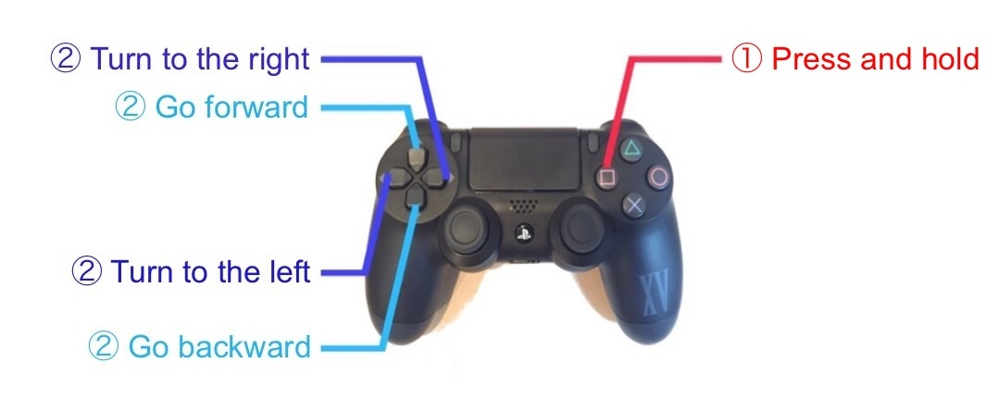
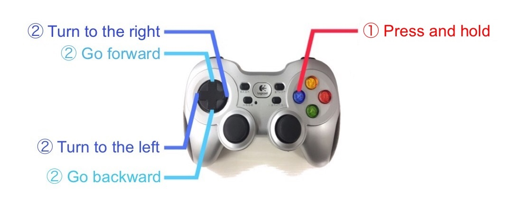

# raspimouse_game_controller

Package for operating Raspberry Pi Mouse with some kinds of game controllers.

This package supports the following controllers:

* DUALSHOCK 4
* Logicool Wireless Gamepad F710

# Requirements

This package requires the following to run:

* Ubuntu
  * Ubuntu 16.04 (Ubuntu 16.04 Server recomended)
* ROS
  * Kinetic Kame
* ROS Package
  * Raspberry Pi Mouse Controller - [ryuichiueda/raspimouse_ros_2](https://github.com/ryuichiueda/raspimouse_ros_2)

# Installation

First of all, install the latest stable version of ROS.  
Please refer to [ROS WiKi](http://wiki.ros.org/kinetic/Installation) for installation.

Next, download the dependent ROS package into `~/catkin_ws/src` and build it.

```
cd ~/catkin_ws/src
git clone https://github.com/ryuichiueda/raspimouse_ros_2.git
cd ~/catkin_ws && catkin_make && source ~/catkin_ws/devel/setup.bash
```

Finally, download this repository and build it.

```
cd ~/catkin_ws/src
git clone https://github.com/zaki0929/raspimouse_game_controller.git
cd ~/catkin_ws && catkin_make && source ~/catkin_ws/devel/setup.bash
```

# Usage

## ps4_cmd_vel.py

This is a script for connecting Raspberry Pi Mouse to a DUALSHOCK 4.

To launch this script:

```
rosrun raspimouse_game_controller ps4_cmd_vel.py
```

### how to control

To give motion command, you must press the button drawn a square. 
With the press, you can control the robot with the four arrow buttons.  
By pressing the up/down button, you can give the velocity of front/back
direction respectively.  
Angular velocity can be then given by pressing the right or left button.



## logicool_cmd_vel.py

This is a script for connecting Raspberry Pi Mouse to a Logicool Wireless Gamepad F710. 

To launch this script:

```
rosrun raspimouse_game_controller logicool_cmd_vel.py
```

### how to control

To give motion command, you must press the X button. 
With the press, you can control the robot with the four arrow buttons.  
By pressing the up/down button, you can give the velocity of front/back
direction respectively.  
Angular velocity can be then given by pressing
the right or left button.



